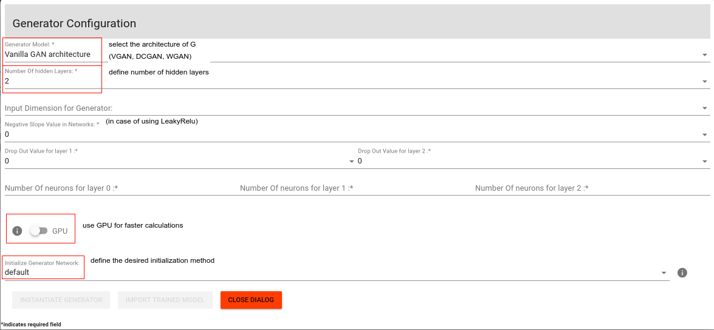
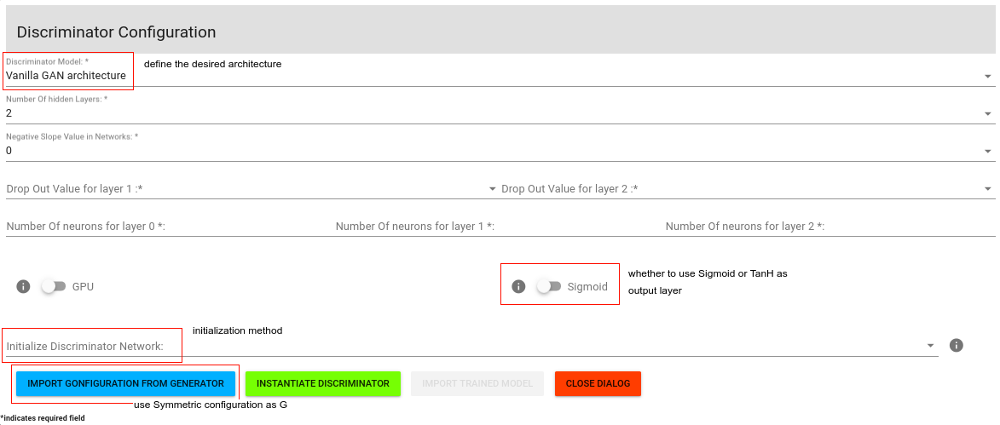
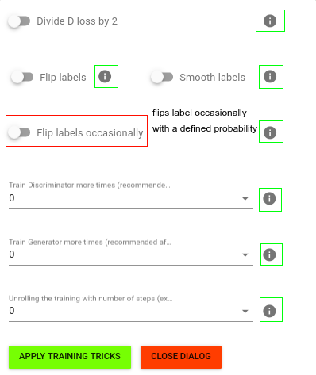

# byogan

byo-gan product for configuring, training and interacting with GANs.
install npm dependencies

# byogan-app
FrontEnd part of BYOGan: developed mainly using [VueJS](https://vuejs.org/) and [JavaScript](https://www.javascript.com/).


``` bash
# necessary JavaScript(FrontEnd) modules can be found in package.json

## to install VueCLI:
npm install -g @vue/cli

## install dependencies
npm install

## start:
npm start

## serve with hot reload at localhost:8080
npm run dev

## build for production with minification
npm run build

## build for production and view the bundle analyzer report
npm run build --report
```

# Tool UIs:

The tool offers extended configuration of most of the GAN framework components.
This can help beginners get started with this complex framework, and it can also help practitioners apply custom configuration and track the learning process.

### * Dataset:
This is the first component to configure as it will link to the Real Data of interest which we want our model to learn. <br />
The tool offers between selecting a defined Dataset (MNIST, FashionMNIST) or a local one (image folder, CSV file). <br />
The configuration tool looks as follows: <br />
<br />


<br />

### * Generator:
This component is the one responsible for learning the Data distribution of real data of interest, by relying on the power of [Artificial Neural Networks](https://pytorch.org/docs/stable/nn.html). <br />
The tool offers multiplicity of configurations for this component, starting by selecting an architecture then configuring important parameters for the Generator model. <br />
An example of the configuration tool looks as follows: <br />
<br />


<br />

### * Discriminator:
This is the other important neural network model in the GAN framework, as it is responsible for "guiding" the Generator to produce realistic outputs. The Discriminator, mainly, processes inputs and classifies them as being Real or fake.
As for the Generator, the tool offers multiplicity of configurations for the Discriminator, starting by selecting an architecture then configuring important parameters for the Discriminator model (It is also possible to built the Discriminator relying on the configuratin of The Generator). <br />
An example of the configuration tool looks as follows: <br />
<br />


<br />

### * Training Tricks:
The training process of the GAN is complex as it relies on an adversarial competition between two powerful models (Generator Vs Discriminator) and in many cases it faces difficulties. As a results several training enhancements have been proposed such as the paper [Improved Techniques for Training GANs](https://arxiv.org/pdf/1606.03498.pdf), the repo [Gan hacks](https://github.com/soumith/ganhacks). <br />
This techniques can help stabilize the training process and avoid some pitfalls. <br />
The configuration tool looks as follows (each icon on the right of the configuration element contains some helpful explanation for the purpose of the proposed training trick): <br />
<br />


<br />

<br />
To have a better understanding the the tool workflow please have a look at the documentation file [tool_workflow.README](https://github.com/BYOGan/BYOGan/blob/master/tool_workflow.md), or refer to the Gif [tool_demo.gif](https://github.com/BYOGan/BYOGan/blob/master/tool_demo.gif)
